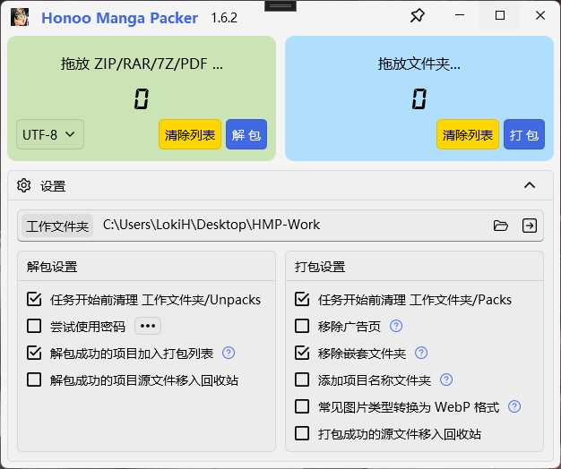

# Honoo Manga Packer

- [Honoo Manga Packer](#honoo-manga-packer)
  - [INTRODUCTION](#introduction)
  - [SCREENSHOTS](#screenshots)
  - [CHANGELOG](#changelog)
    - [1.6.0](#160)
  - [COMPONENTS](#components)
  - [LICENSE](#license)

## INTRODUCTION

漫画和图包的打包辅助工具。支持 ZIP/RAR/7Z/PDF 解压缩和重新打包到无压缩 ZIP 文件，同时自动删除 Windows 缩略图文件，MacOSX 缓存文件等。

支持试用密码，移除广告页，转换 WebP 图片格式。

解压缩功能由 [SharpCompress](https://github.com/adamhathcock/sharpcompress) 实现。

## SCREENSHOTS

## CHANGELOG

### 1.6.0

**Refactored* 调整选项逻辑。

## COMPONENTS

[SharpCompress](https://github.com/adamhathcock/sharpcompress)

[PdfiumViewer](https://github.com/Bluegrams/PdfiumViewer/)

[ImageResizer.Plugins.PdfiumRenderer.Pdfium.Dll](https://www.nuget.org/packages/ImageResizer.Plugins.PdfiumRenderer.Pdfium.Dll)

[SixLabors.ImageSharp](https://github.com/SixLabors/ImageSharp)

## LICENSE

[Apache-2.0](LICENSE) license.
